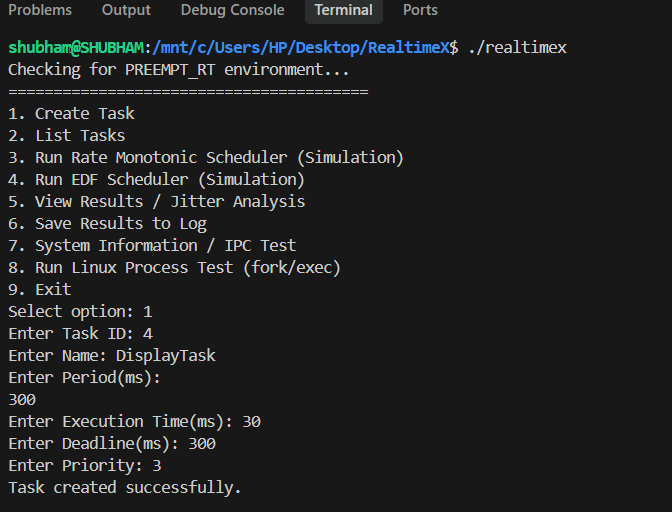
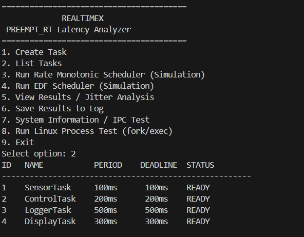
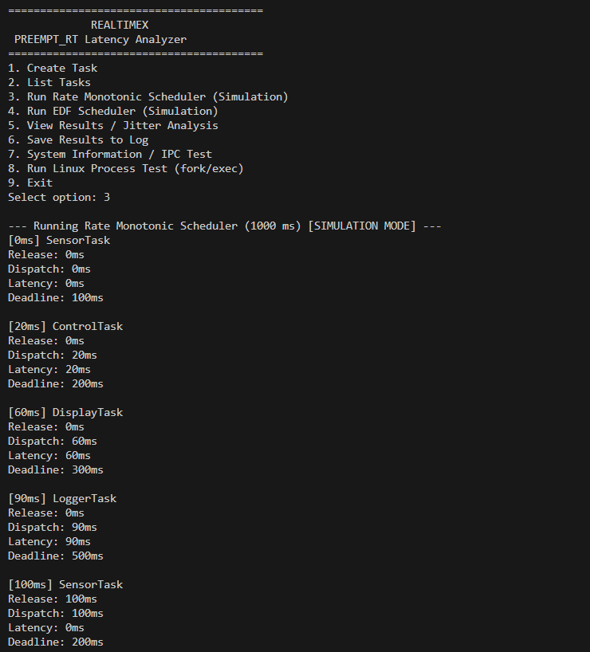
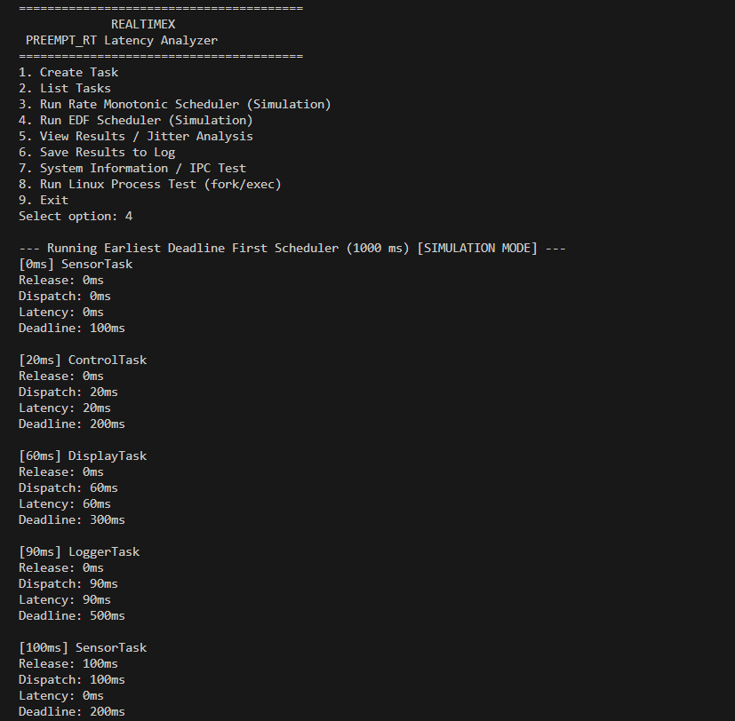
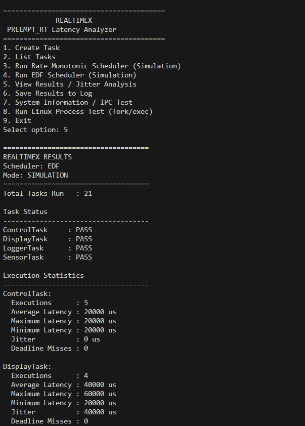
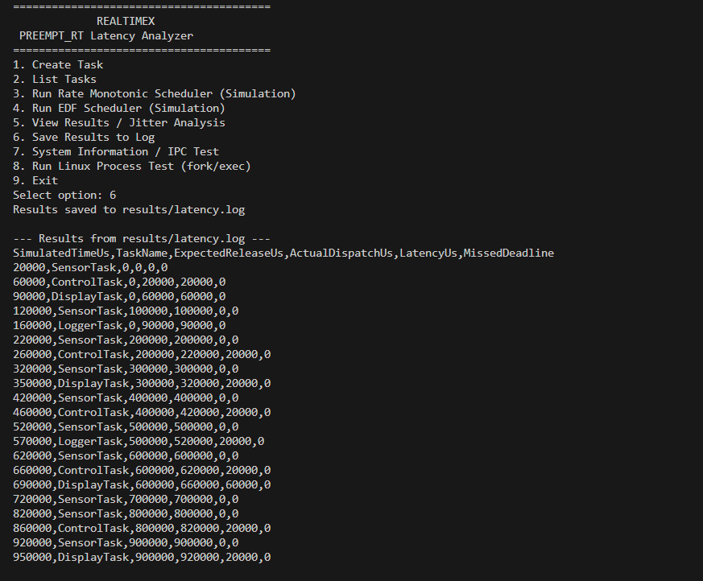
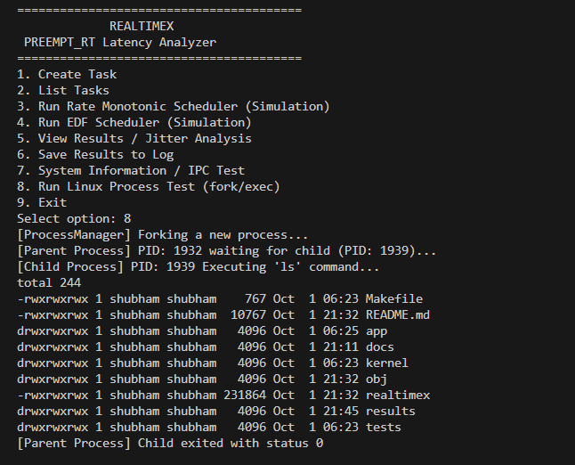

# RealtimeX – PREEMPT_RT Latency Analyzer & Deterministic Task Scheduling Framework

## 1. Project Overview
RealtimeX is a C/C++ based real-time scheduling simulation and latency analysis framework. It is designed to demonstrate deterministic task scheduling concepts for periodic processes. Through an interactive command-line interface, the project allows developers to configure task sets, simulate execution under different real-time scheduling models, and rigorously analyze system latency and jitter.

## 2. Problem Statement
In real-time systems, it is not enough for a task to eventually execute and produce the correct output; it must do so within strict timing constraints. Tasks are bound by characteristics such as period, execution time, and strict deadlines. A real-time system must track when tasks are released versus when they are actually dispatched by the CPU. Delays in dispatching create scheduling latency, variations in this latency create jitter, and taking too long to execute results in deadline misses—all of which can cause catastrophic failures in safety-critical systems.

## 3. Project Objective
The primary objective of RealtimeX is to practically demonstrate these real-time scheduling problems by:
- Simulating periodic task execution in a controlled environment.
- Comparing the behavioral differences between Rate Monotonic (RM) and Earliest Deadline First (EDF) scheduling.
- Accurately measuring scheduling latency and analyzing jitter across multiple task cycles.
- Detecting and reporting deadline misses.
- Recording performance metrics to external logs for further analysis.
- Validating native Linux system programming functionalities (IPC and process management).

## 4. Main Features
- **Task Creation & Management**: Interactively define custom periodic tasks.
- **Task Listing**: Display all configured tasks with their respective parameters.
- **Rate Monotonic (RM) Scheduling Simulation**: Fixed-priority scheduling simulation.
- **Earliest Deadline First (EDF) Scheduling Simulation**: Dynamic-priority scheduling simulation.
- **Latency & Jitter Analysis**: Precise variance calculations across task executions.
- **Deadline Monitoring**: Flags tasks that fail to complete within their absolute deadlines.
- **Result Logging**: Exports scheduling data to CSV-formatted log files.
- **PREEMPT_RT Detection**: Determines if the underlying kernel is patched for hard real-time execution.
- **Linux IPC Test**: Validates System V Shared Memory operations.
- **Linux fork/exec Test**: Validates parent/child process lifecycle management.

## 5. Real-Time Scheduling Concepts

### Rate Monotonic Scheduling (RM)
RM is a fixed-priority scheduling algorithm. Tasks are assigned static priorities based on their cycle durations: a shorter period results in a higher priority. The framework pre-empts lower-priority tasks when higher-priority tasks are released.

### Earliest Deadline First Scheduling (EDF)
EDF is a dynamic-priority scheduling algorithm. The scheduler places tasks in a priority queue based on their absolute deadlines: the task with the earliest absolute deadline is selected for dispatch. 


## 6. Task Model / Task Parameters
RealtimeX utilizes the following parameters to define a task:
- **Task ID**: Unique identifier.
- **Task Name**: Human-readable designation.
- **Period (ms)**: The cycle time at which the task is repeatedly released.
- **Execution Time (ms)**: The actual processing time required.
- **Deadline (ms)**: The relative time from release by which the task must complete.
- **Priority**: Used for tie-breaking or fallback scheduling.
- **Status**: Ready, Running, Completed, or Missed Deadline.

**Default Simulated Tasks:**
- `SensorTask`: Period = 100ms, Execution = 20ms, Deadline = 100ms
- `ControlTask`: Period = 200ms, Execution = 40ms, Deadline = 200ms
- `LoggerTask`: Period = 500ms, Execution = 50ms, Deadline = 500ms

## 7. Latency, Jitter, and Deadline Miss
The framework calculates critical real-time metrics as follows:
- **Scheduling Latency**: Calculated as `Actual Dispatch Time - Expected Release Time`.
- **Jitter**: Calculated as the variance in latency, specifically `Maximum Latency - Minimum Latency` for a given task across all its executions.
- **Deadline Miss**: Triggered if a task's `Completion Time > Absolute Deadline`.

## 8. PREEMPT_RT Detection
RealtimeX checks the operating system environment at startup to detect the presence of the `PREEMPT_RT` patch. 
- If detected, the framework can interface directly with hard real-time kernel properties.
- If not detected (e.g., standard WSL or Ubuntu), the application gracefully falls back to **SIMULATION / NON-RT MODE**, providing analytical simulations rather than true real-time kernel measurements.


## 9. Project Architecture
```text
RealtimeX CLI (main.cpp)
     |
     v
Task Management (TaskManager)
     |
     +--------------------------+
     |                          |
     v                          v
RM Scheduler               EDF Scheduler
     |                          |
     +------------+-------------+
                  |
                  v
       Latency/Jitter Analysis
                  |
                  v
       Result Logging (Logger)
```
*System APIs (ProcessManager, IPCManager, SignalHandler) operate parallel to the core logic.*

## 10. Project Structure
The repository is structured to maintain a clean separation of concerns:
```text
RealtimeX/
├── Makefile       # GNU Make build configuration
├── README.md      # Project documentation
├── app/           # C++ source code and headers
├── kernel/        # LKM (Linux Kernel Module) source
├── docs/          # Detailed development stage documents
├── results/       # Directory for generated CSV logs
└── tests/         # Automated input files for demonstration
```

## 11. Application Menu
Upon starting the application, the following interactive menu is presented:
1. **Create Task**: Prompts the user to input custom task parameters (ID, Name, Period, Exec, Deadline, Priority).
2. **List Tasks**: Prints a formatted table of all currently loaded tasks.
3. **Run Rate Monotonic Scheduler**: Executes the RM simulation for 1000ms and prints dispatch metrics.
4. **Run EDF Scheduler**: Executes the EDF simulation for 1000ms and prints dispatch metrics.
5. **View Results / Jitter Analysis**: Computes and displays latency, jitter, and deadline misses.
6. **Save Results to Log**: Exports the most recent simulation run to `results/latency.log`.
7. **System Information / IPC Test**: Queries OS kernel version and verifies SysV Shared Memory.
8. **Run Linux Process Test (fork/exec)**: Forks a child process to execute a shell command (`ls -l`).
9. **Exit**: Gracefully shuts down the framework.


## 12. Build Instructions
To compile the user-space application, simply run:
```bash
make clean
make
```

## 13. Run Instructions
To execute the compiled framework:
```bash
./realtimex
```

## 14. Demonstration / Usage Flow
To fully explore the framework's capabilities, follow this recommended sequence:
1. Start the application (`./realtimex`).
2. Select `2` to view the default task list.
3. Select `3` to run the RM Scheduler simulation.
4. Select `5` to view the jitter and latency statistics for the RM run.
5. Select `4` to run the EDF Scheduler simulation.
6. Select `6` to save the EDF results to disk.
7. Select `7` to test System V Shared memory mechanisms.
8. Select `8` to verify POSIX `fork()` and `exec()` capabilities.
9. Select `9` to exit.

## 15. Example Output
**Task Listing:**
```text
ID   NAME           PERIOD    DEADLINE  STATUS         
------------------------------------------------------
1    SensorTask     100ms     100ms     READY          
2    ControlTask    200ms     200ms     READY          
3    LoggerTask     500ms     500ms     READY          
```

**Jitter Analysis Output:**
```text
ControlTask:
  Executions      : 5
  Average Latency : 20000 us
  Maximum Latency : 20000 us
  Minimum Latency : 20000 us
  Jitter          : 0 us
  Deadline Misses : 0
```

## 16. Result Logging
Results are safely serialized to the filesystem for post-analysis. 
- **File Location**: `results/latency.log`
- **Format**: CSV 
- **Stored Fields**:
  - `SimulatedTimeUs`: The absolute simulation timeline in microseconds.
  - `TaskName`: The target task.
  - `ExpectedReleaseUs`: When the task was scheduled to be released.
  - `ActualDispatchUs`: When the task was actually dispatched by the CPU.
  - `LatencyUs`: `ActualDispatchUs - ExpectedReleaseUs`.
  - `MissedDeadline`: Boolean integer (0 or 1).

## 17. Testing
| Test | Expected Result | Status |
|------|-----------------|--------|
| Build | Project builds successfully via `make` | PASS |
| Task listing | STL containers correctly store and display tasks | PASS |
| RM scheduler | Preemptions occur based on periods, 100% deterministic | PASS |
| EDF scheduler | Preemptions occur based on dynamic absolute deadlines | PASS |
| Latency analysis | Dispatch vs Release accurately measured | PASS |
| Jitter analysis | Min/Max variances successfully extracted | PASS |
| Result logging | CSV successfully truncates and saves | PASS |
| IPC test | SysV Shared memory (`shmget`/`shmat`) initializes | PASS |
| fork/exec | Child process executes host binaries safely | PASS |

## 18. Linux IPC Test
The framework includes a dedicated inter-process communication (IPC) test utilizing **System V Shared Memory**. The `IPCManager` allocates a shared memory segment using `shmget`, attaches to it with `shmat`, writes a test payload string, and immediately reads it back to verify kernel-level memory mapping functionality.

## 19. Linux fork/exec Test
The `ProcessManager` utilizes standard POSIX APIs to test process lifecycles. It utilizes `fork()` to split the application. The parent process safely blocks using `waitpid()`, while the child process utilizes `execlp()` to overwrite its memory space and execute standard Linux utilities (e.g., `ls -l`), before gracefully terminating.


## 20. Future Improvements
- Expand the `Kernel/` module to export actual hardware timer interrupts to the user-space scheduler.
- Introduce advanced scheduling algorithms (e.g., Priority Ceiling Protocol, Priority Inheritance).
- Introduce multi-core CPU affinity simulation.

## 21. Outputs 









## 22. Conclusion
RealtimeX successfully demonstrates complex system programming paradigms entirely in C/C++. By combining mathematical scheduling models with native Linux kernel APIs (fork, exec, SysV IPC), it serves as a robust educational tool for understanding the strict demands of deterministic real-time execution.

## 23. Quick Start
```bash
git clone <repository_url>
cd RealtimeX
make clean
make
./realtimex
```
