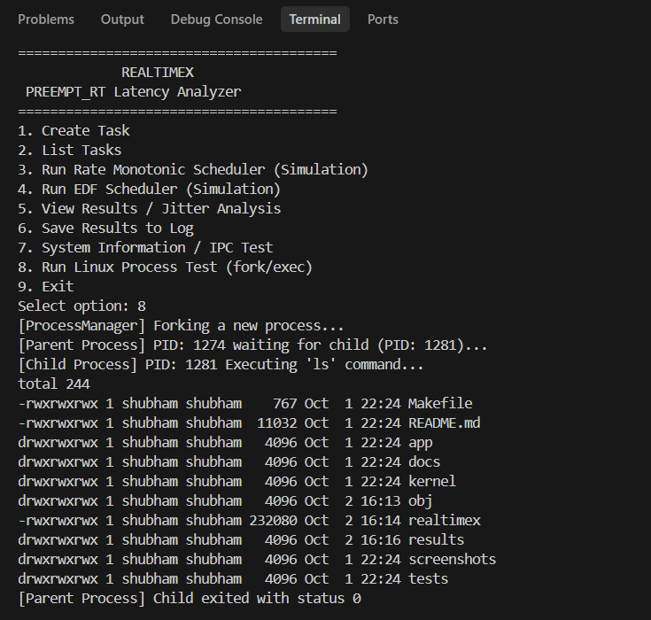
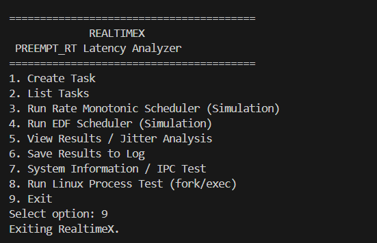

# RealtimeX – PREEMPT_RT Latency Analyzer & Deterministic Task Scheduling Framework

## 1. Project Overview
RealtimeX is a C/C++ based framework for deterministic task scheduling simulation and latency analysis. It explores real-time constraints by providing an interactive command-line application to configure periodic tasks, run scheduling simulations, and analyze latency and jitter. Importantly, it correctly detects and operates within a genuinely PREEMPT_RT-enabled WSL2 Linux kernel environment.

## 2. Problem Statement
In real-time systems, a task must not only produce correct output but also complete within strict timing constraints defined by its period, execution time, and deadline. Delays between a task's expected release and its actual CPU dispatch time create scheduling latency. The variance in this latency constitutes jitter. If execution stretches beyond the allocated deadline, the task misses its deadline—an unacceptable scenario in safety-critical systems. 

## 3. Project Objectives
- Verify and report the presence of a genuine `PREEMPT_RT` Linux kernel.
- Simulate periodic task execution using Rate Monotonic (RM) and Earliest Deadline First (EDF) policies.
- Accurately compute scheduling latency, calculate jitter, and detect deadline misses for simulated schedules.
- Log performance metrics to external CSV-formatted files.
- Validate native Linux system programming operations, including SysV IPC and process management (fork/exec).

## 4. Main Features
- **PREEMPT_RT Environment Detection**: Verifies if the underlying host kernel has `CONFIG_PREEMPT_RT=y` enabled.
- **Task Management**: Interactively define custom periodic tasks or use default tasks.
- **Scheduling Simulations**: Provides explicit *simulation modes* for RM and EDF algorithms.
- **Latency & Jitter Analysis**: Computes precise task variances based on dispatch metrics.
- **Result Logging**: Serializes simulation outputs into parsable `results/latency.log` CSV records.
- **System Testing**: Validates System V Shared Memory operations and POSIX `fork()`/`exec()` lifecycle management.

## 5. Real-Time Scheduling Concepts

### Rate Monotonic Scheduling (RM)
RM is a fixed-priority scheduling algorithm. Tasks receive static priorities inversely proportional to their cycle durations: shorter periods get higher priorities. The simulation demonstrates how lower-priority tasks are preempted when higher-priority tasks are released.

### Earliest Deadline First (EDF)
EDF is a dynamic-priority scheduling algorithm. The scheduler prioritizes tasks based on their absolute deadlines: the task with the closest absolute deadline is dispatched first.

## 6. Task Model / Task Parameters
RealtimeX defines tasks using the following parameters:
- **Task ID**: Unique integer identifier.
- **Task Name**: Human-readable designation string.
- **Period (ms)**: The recurring cycle time at which the task is released.
- **Execution Time (ms)**: Simulated CPU processing duration.
- **Deadline (ms)**: The relative time from release by which execution must complete.
- **Priority**: Used for tie-breaking or fallback scheduling priority.
- **Status**: The runtime state (e.g., READY).

**Default Tasks (as defined in source):**
- `SensorTask`: Period = 100 ms, Execution = 20 ms, Deadline = 100 ms, Priority = 1
- `ControlTask`: Period = 200 ms, Execution = 40 ms, Deadline = 200 ms, Priority = 2
- `LoggerTask`: Period = 500 ms, Execution = 50 ms, Deadline = 500 ms, Priority = 3


## 7. Latency, Jitter, and Deadline Miss
The framework analyzes these critical metrics based on the simulation data:
- **Latency**: Calculated precisely as `Actual Dispatch Time - Expected Release Time`.
- **Jitter**: Calculated as the variance in a task's latency across its executions, explicitly `Maximum Latency - Minimum Latency`.
- **Deadline Miss**: A miss is recorded if a task's execution extends past its absolute deadline.


## 8. Project Architecture
```text
RealtimeX CLI (main.cpp)
      |
      v
 TaskManager
      |
      +--------------------------+
      |                          |
      v                          v
 RM Scheduler (Simulation)  EDF Scheduler (Simulation)
      |                          |
      +------------+-------------+
                   |
                   v
        Latency/Jitter Analysis
                   |
                   v
         Result Logger (CSV)
```
*System modules (ProcessManager, IPCManager, SignalHandler) run concurrently with this logic to validate Linux functionality.*

## 9. Project Structure
The repository is organized directly around its components:
- `Makefile` - GNU Make build configuration.
- `README.md` - Project documentation.
- `app/` - C/C++ source and header files containing the core logic.
- `kernel/` - Target directory for any Linux Kernel Module implementations.
- `docs/` - Project documentation and notes.
- `results/` - Destination folder for the generated `.log` CSV files.
- `screenshots/` - Media references for documentation.
- `tests/` - Contains sample inputs.

*(Note: `obj/` and the `realtimex` executable are generated automatically during the build process.)*


## 10. Build Instructions
RealtimeX is built using a standard Makefile. It requires a C++17 compatible compiler (e.g., `g++`).
```bash
make clean
make
```

## 11. Run Instructions
```bash
./realtimex
```

## 12. Demonstration / Usage Flow
1. Start the application (`./realtimex`). Observe the `PREEMPT_RT environment detected.` confirmation.
2. Select `1` to optionally create a new task (e.g., `MotorTask`).
3. Select `2` to view the `READY` tasks in the internal list.
4. Select `3` or `4` to execute a scheduling simulation (RM or EDF). Notice the `[SIMULATION MODE]` tag.
5. Select `5` to view the detailed Jitter Analysis of the simulation.
6. Select `6` to dump the latest results into a CSV log file.
7. Select `7` to execute the IPC Shared Memory test and verify `PREEMPT_RT: DETECTED` dynamically.
8. Select `8` to test the parent/child process spawning via `fork()`/`exec()`.
9. Select `9` to exit.


## 13. Testing
| Test Component | Observation | Status |
|---|---|---|
| Build | `make clean && make` completes without errors | PASS |
| Application Startup | Successfully executes `./realtimex` | PASS |
| PREEMPT_RT Detection | `PREEMPT_RT environment detected.` printed via `/proc/config.gz` check | PASS |
| Task Creation | Successfully instantiates interactive custom tasks | PASS |
| Task Listing | Successfully outputs all internal task structs | PASS |
| RM Simulation | Schedules tasks deterministically in `[SIMULATION MODE]` | PASS |
| EDF Simulation | Preempts dynamically in `[SIMULATION MODE]` | PASS |
| Results / Jitter | Correctly calculates `Max - Min` latency variances | PASS |
| Result Logging | Exports to `results/latency.log` matching the CSV spec | PASS |
| System Information | Displays correct kernel version and PREEMPT_RT detection | PASS |
| IPC Test | System V `shmget`/`shmat` memory mapping reads/writes string payloads | PASS |
| fork/exec Test | Standard POSIX parent `waitpid()` blocking for a child executing `/bin/ls` | PASS |
| Exit | Program gracefully shuts down | PASS |


## 14. Future Improvements
- Expand project to include actual POSIX real-time thread (`pthread`) experiments.
- Evaluate `SCHED_FIFO` and `SCHED_RR` scheduling policy interactions.
- Introduce CPU affinity configuration.
- Implement multi-core scheduling simulations.
- Direct runtime timing measurements to complement the simulation.

## 15. Screenshots

### Create Task


### Task List


### RM Scheduler


### EDF Scheduler


### Jitter Analysis


### Result Log


### System Information / IPC Test


### Linux Process Test


### Exit


## 16. Limitations
- **Simulation Mode**: Both RM and EDF currently operate strictly as deterministic simulations, executing logic based on internal counters rather than physical kernel timers.
- **Hardware Isolation**: The calculated latency and jitter values are outputs of the simulated scheduling and do not represent direct kernel-level PREEMPT_RT latencies.
- **Scheduler Replacement**: Detecting PREEMPT_RT verifies the host environment capability, but RealtimeX does not hijack or replace the actual Linux kernel scheduler.
- **Production Use**: This framework serves strictly as an educational/experimental tool and should not be deployed as safety-critical production software.

## 17. Conclusion
RealtimeX stands as an effective C/C++ educational framework that bridges real-time Linux configuration with deterministic scheduling theory. By confirming host PREEMPT_RT environments and simulating RM/EDF strategies alongside standard Linux POSIX/IPC mechanisms, it comprehensively demonstrates core real-time systems programming concepts.

## 18. Quick Start
```bash
git clone <repository_url>
cd RealtimeX
make clean
make
./realtimex
```

## Author

**Shubham Saurav Prajapati**<br>
**B.Tech Computer Science & Engineering**<br>
**SOA University**

## License
This project is developed for educational and academic purposes.


